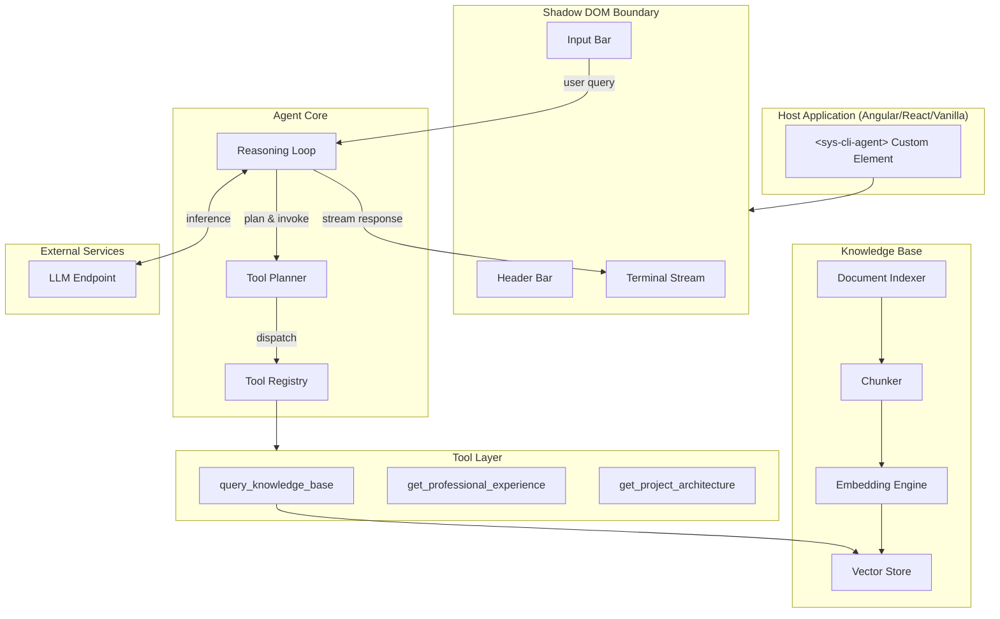
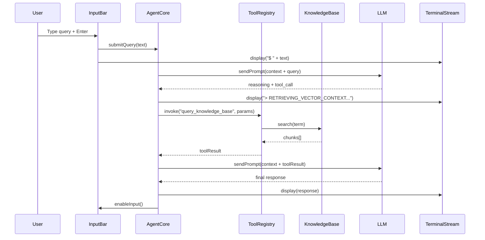

# Design Document: SYS_CLI // AGENT

## Overview

SYS_CLI // AGENT is a standalone Lit Web Component (`<sys-cli-agent>`) that delivers an AI-powered conversational agent with a terminal-inspired Technical Brutalism interface. The system combines an autonomous reasoning agent loop with a local RAG knowledge base, packaged as a single framework-agnostic custom element suitable for embedding in any web application.

### Design Goals

1. **Autonomy** — The agent reasons, plans, and invokes tools without user orchestration
2. **Encapsulation** — Shadow DOM isolation ensures zero style leakage in any host app
3. **Extensibility** — Decorator-based tool registration enables adding new capabilities
4. **Portability** — No framework dependencies beyond Lit; works in Angular, React, Vue, or vanilla HTML
5. **Accessibility** — WCAG AA compliant with full keyboard navigation and screen reader support

### Technology Decisions

| Concern | Choice | Rationale |
|---------|--------|-----------|
| Component Framework | Lit 3.x | Lightweight (~7KB), standards-based, Shadow DOM native |
| Language | TypeScript | Type safety for tool schemas and agent state |
| Vector Embeddings | Transformers.js (ONNX) | Client-side embeddings without server dependency |
| Vector Store | In-memory HNSW index | Fast cosine similarity search, no external DB |
| Styling | CSS-in-JS (Lit css tagged template) | Shadow DOM scoped, design system tokens |
| Build | Vite | Fast bundling, tree-shaking, ESM output |
| Testing | Vitest + fast-check | Unit + property-based testing |

---

## Architecture

### High-Level System Diagram



### Component Communication Diagram



---

## Components and Interfaces

### 1. SysCLIAgentElement (Web Component Shell)

The root Lit element that owns the Shadow DOM tree and orchestrates child components.

```typescript
// src/sys-cli-agent.element.ts
import { LitElement, html, css } from 'lit';
import { customElement, property, state } from 'lit/decorators.js';

@customElement('sys-cli-agent')
export class SysCLIAgentElement extends LitElement {
  // --- Public HTML Attributes ---
  @property({ type: String, reflect: true })
  endpoint: string = '';

  @property({ type: String, reflect: true, attribute: 'kb-path' })
  kbPath: string = '';

  @property({ type: String, reflect: true, attribute: 'allowed-origins' })
  allowedOrigins: string = '*';

  // --- Internal State ---
  @state() private _connectionStatus: 'idle' | 'connecting' | 'connected' | 'error' = 'idle';
  @state() private _entries: TerminalEntry[] = [];
  @state() private _isProcessing: boolean = false;

  // --- Lifecycle ---
  connectedCallback(): void;
  disconnectedCallback(): void;

  // --- Public API (via DOM events) ---
  // Emits: 'agent-ready', 'agent-error', 'agent-response'
}
```

### 2. AgentCore (Reasoning Engine)

Manages the LLM conversation loop with autonomous tool invocation.

```typescript
// src/agent/agent-core.ts
export interface AgentCoreConfig {
  endpoint: string;
  model?: string;
  maxTools: number;          // default: 10
  maxCycles: number;         // default: 15
  timeoutMs: number;         // default: 120_000
  toolTimeoutMs: number;     // default: 30_000
}

export interface ReasoningStep {
  type: 'plan' | 'tool_call' | 'tool_result' | 'response' | 'error';
  content: string;
  toolName?: string;
  timestamp: number;
}

export class AgentCore {
  constructor(config: AgentCoreConfig, toolRegistry: ToolRegistry);

  /** Execute reasoning loop for a user query */
  async processQuery(query: string): AsyncGenerator<ReasoningStep>;

  /** Abort active processing */
  abort(): void;

  /** Check if currently processing */
  get isProcessing(): boolean;
}
```

### 3. ToolRegistry

Decorator-based tool registration and dispatch system.

```typescript
// src/agent/tool-registry.ts
export interface ToolSchema {
  name: string;
  description: string;
  parameters: Record<string, ParameterDef>;
}

export interface ParameterDef {
  type: 'string' | 'number' | 'boolean';
  required: boolean;
  description: string;
  maxLength?: number;
  minLength?: number;
}

export interface ToolResult {
  success: boolean;
  data: unknown;
  error?: string;
}

export class ToolRegistry {
  /** Register a tool with its schema and handler */
  register(schema: ToolSchema, handler: ToolHandler): void;

  /** Invoke a tool by name with validated params */
  async invoke(name: string, params: Record<string, unknown>): Promise<ToolResult>;

  /** Get all registered tool schemas (for LLM context) */
  getSchemas(): ToolSchema[];

  /** Validate params against a tool's declared schema */
  validate(name: string, params: Record<string, unknown>): ValidationResult;
}

/** Decorator for tool class methods */
export function tool(schema: ToolSchema): MethodDecorator;
```

### 4. KnowledgeBase

Document indexing and vector search engine.

```typescript
// src/knowledge-base/knowledge-base.ts
export interface KBConfig {
  sourcePath: string;
  chunkSize: number;         // default: 512 tokens
  chunkOverlap: number;      // default: 50 tokens
  topK: number;              // default: 5, range [1, 20]
  similarityThreshold: number; // default: 0.7, range [0.0, 1.0]
}

export interface DocumentChunk {
  id: string;
  sourceFile: string;
  content: string;
  embedding: Float32Array;
  tokenCount: number;
  chunkIndex: number;
}

export interface SearchResult {
  chunk: DocumentChunk;
  score: number;
}

export class KnowledgeBase {
  constructor(config: KBConfig);

  /** Index all documents from source directory */
  async indexAll(): Promise<IndexResult>;

  /** Re-index a single changed document */
  async reindex(filePath: string): Promise<IndexResult>;

  /** Search for relevant chunks */
  async search(query: string, topK?: number): Promise<SearchResult[]>;

  /** Get indexing status */
  get status(): 'idle' | 'indexing' | 'ready' | 'error';
}
```

### 5. UI Components

#### HeaderBar

```typescript
// src/ui/header-bar.ts
export class HeaderBar extends LitElement {
  @property({ type: String }) status: 'idle' | 'connecting' | 'connected' | 'error';
}
```

#### TerminalStream

```typescript
// src/ui/terminal-stream.ts
export interface TerminalEntry {
  id: string;
  type: 'user' | 'reasoning' | 'response' | 'error' | 'processing';
  content: string;
  timestamp: number;
}

export class TerminalStream extends LitElement {
  @property({ type: Array }) entries: TerminalEntry[] = [];

  /** Append an entry and auto-scroll */
  appendEntry(entry: TerminalEntry): void;

  /** Remove processing indicator */
  clearProcessing(): void;
}
```

#### InputBar

```typescript
// src/ui/input-bar.ts
export class InputBar extends LitElement {
  @property({ type: Boolean }) disabled: boolean = false;

  // Emits: 'query-submit' with detail: { text: string }
}
```

### 6. PostMessage Bridge (Cross-Domain Communication)

```typescript
// src/bridge/post-message-bridge.ts
export interface BridgeConfig {
  targetOrigin: string;       // default: '*'
  allowedOrigins: string[];   // configurable allowlist
}

export type MessageType = 'state-change' | 'user-interaction' | 'config-update';

export interface BridgeMessage {
  type: MessageType;
  payload: unknown;
  source: 'sys-cli-agent';
}

export class PostMessageBridge {
  constructor(config: BridgeConfig);

  /** Send message to parent frame */
  send(type: MessageType, payload: unknown): void;

  /** Register handler for incoming messages */
  onMessage(handler: (msg: BridgeMessage) => void): void;

  /** Start listening for parent messages */
  connect(): void;

  /** Stop listening and cleanup */
  disconnect(): void;
}
```

---

## Data Models

### Agent Conversation State

```typescript
interface ConversationState {
  id: string;
  query: string;
  startTime: number;
  cycleCount: number;
  toolInvocations: ToolInvocation[];
  reasoningSteps: ReasoningStep[];
  finalResponse: string | null;
  status: 'planning' | 'executing' | 'complete' | 'timeout' | 'error';
}

interface ToolInvocation {
  toolName: string;
  params: Record<string, unknown>;
  result: ToolResult | null;
  durationMs: number;
  error?: string;
}
```

### Knowledge Base Document Model

```typescript
interface IndexedDocument {
  filePath: string;
  fileType: 'markdown' | 'json';
  lastModified: number;
  hash: string;              // SHA-256 for change detection
  chunks: DocumentChunk[];
}

interface IndexResult {
  totalDocuments: number;
  indexedDocuments: number;
  failedDocuments: { path: string; error: string }[];
  totalChunks: number;
  durationMs: number;
}
```

### Terminal Entry Model

```typescript
interface TerminalEntry {
  id: string;                // UUID
  type: 'user' | 'reasoning' | 'response' | 'error' | 'processing';
  content: string;
  timestamp: number;
  metadata?: {
    toolName?: string;
    cycleNumber?: number;
  };
}
```

### LLM Communication Protocol

```typescript
interface LLMRequest {
  model: string;
  messages: LLMMessage[];
  tools?: LLMToolDef[];
  temperature?: number;
  max_tokens?: number;
}

interface LLMMessage {
  role: 'system' | 'user' | 'assistant' | 'tool';
  content: string;
  tool_calls?: ToolCall[];
  tool_call_id?: string;
}

interface ToolCall {
  id: string;
  type: 'function';
  function: {
    name: string;
    arguments: string; // JSON-encoded
  };
}

interface LLMToolDef {
  type: 'function';
  function: {
    name: string;
    description: string;
    parameters: JSONSchema;
  };
}
```

### Configuration Model

```typescript
interface SysCLIAgentConfig {
  // LLM
  endpoint: string;          // Required, max 2048 chars
  model?: string;

  // Knowledge Base
  kbPath?: string;           // max 512 chars
  chunkSize?: number;        // default 512
  chunkOverlap?: number;     // default 50
  topK?: number;             // default 5, range [1, 20]
  similarityThreshold?: number; // default 0.7, range [0.0, 1.0]

  // Agent
  maxTools?: number;         // default 10
  maxCycles?: number;        // default 15
  timeoutMs?: number;        // default 120_000

  // Cross-domain
  targetOrigin?: string;     // default '*'
  allowedOrigins?: string[]; // default ['*']
}
```

### Design System Tokens (CSS Custom Properties)

The component uses the workspace design system tokens internally, mapped to the Technical Brutalism aesthetic:

```css
:host {
  /* Surface - maps to workspace design system */
  --sys-bg: var(--color-surface, #FFF8F3);
  --sys-bg-container: var(--color-surface-container, #F8ECDF);
  --sys-bg-high: var(--color-surface-container-high, #F2E6D9);

  /* Text */
  --sys-text: var(--color-on-surface, #201B13);
  --sys-text-muted: var(--color-on-surface-variant, #4E4539);

  /* Borders */
  --sys-border: var(--color-outline-variant, #D2C5B4);
  --sys-border-strong: var(--color-outline, #807667);

  /* Accent */
  --sys-accent: var(--color-primary, #7C580D);
  --sys-accent-container: var(--color-primary-container, #FFDEAB);
  --sys-active-dot: #E5A93B; /* Amber indicator per requirement */

  /* Error */
  --sys-error: var(--color-error, #BA1A1A);
  --sys-error-container: var(--color-error-container, #FFDAD6);

  /* Typography */
  --sys-font: 'JetBrains Mono', 'Fira Code', 'Source Code Pro', 'Courier New', monospace;

  /* Borders */
  --sys-border-width: 1px;
  --sys-border-radius: 0px;
}
```

---


## Correctness Properties

*A property is a characteristic or behavior that should hold true across all valid executions of a system — essentially, a formal statement about what the system should do. Properties serve as the bridge between human-readable specifications and machine-verifiable correctness guarantees.*

### Property 1: Agent Loop Invariants

*For any* user query and any sequence of LLM responses requesting tool invocations, the Agent_Core SHALL invoke no more than 10 tools total and complete no more than 15 reasoning-action cycles before terminating with either a final or partial response.

**Validates: Requirements 1.2, 1.3**

### Property 2: Plan-First Reasoning

*For any* user query processed by the Agent_Core, the first reasoning step emitted SHALL be of type `plan` before any step of type `tool_call` is emitted.

**Validates: Requirements 1.1**

### Property 3: Tool Failure Resilience

*For any* tool invocation that results in an error response, exception, or timeout, the Agent_Core SHALL continue its reasoning loop and eventually produce either a final or partial response without crashing or hanging.

**Validates: Requirements 1.5**

### Property 4: Document Chunking Invariants

*For any* valid markdown or JSON document of arbitrary length, the chunker SHALL produce chunks where each chunk contains at most 512 tokens, and consecutive chunks overlap by exactly 50 tokens.

**Validates: Requirements 2.1**

### Property 5: Search Result Ordering and Bounds

*For any* search query against any indexed corpus with a configured top-k value in [1, 20], the Knowledge_Base SHALL return at most k results, each with a similarity score above the configured threshold, sorted in descending order of score.

**Validates: Requirements 2.2**

### Property 6: Incremental Re-index Preservation

*For any* indexed corpus of N documents, when one document is modified and re-indexed, the chunks belonging to the remaining N-1 unchanged documents SHALL remain identical (same content, same embeddings) before and after the re-index operation.

**Validates: Requirements 2.3**

### Property 7: Invalid Document Resilience

*For any* set of source documents where some are valid and some are malformed (invalid markdown/JSON), the indexer SHALL successfully index all valid documents and skip all invalid ones, producing an index that contains chunks only from valid documents.

**Validates: Requirements 2.7**

### Property 8: Keyword Search Correctness

*For any* search term and any indexed document corpus, all results returned by `query_knowledge_base` SHALL contain all terms from the search string (case-insensitive), and the result count SHALL not exceed 10.

**Validates: Requirements 3.1**

### Property 9: Tool Parameter Validation

*For any* registered tool and any parameter set, the ToolRegistry SHALL accept parameter sets that satisfy all type constraints and required-field constraints declared in the tool's schema, and SHALL reject parameter sets that violate any constraint — including strings that are empty or exceed declared maxLength limits — returning a descriptive error without executing tool logic.

**Validates: Requirements 3.5, 3.8**

### Property 10: Terminal Entry Type Formatting

*For any* terminal entry, the displayed content SHALL follow the formatting rule determined by its type: user entries are prefixed with `$ `, reasoning entries are prefixed with `> ` followed by an uppercase label and ellipsis, response entries have no `$` or `>` prefix, and error entries are rendered with a visually distinct style (error type classification).

**Validates: Requirements 6.1, 6.2, 6.3, 6.8**

### Property 11: Terminal Stream Capacity

*For any* sequence of up to 200 terminal entries appended to the Terminal_Stream, all entries SHALL be retained without eviction for the component lifecycle.

**Validates: Requirements 6.5**

### Property 12: Input Max Length Enforcement

*For any* string longer than 500 characters, the Input_Bar SHALL prevent the full string from being entered (truncating or rejecting characters beyond position 500).

**Validates: Requirements 7.1**

### Property 13: Submit and Clear Behavior

*For any* non-empty, non-whitespace-only string in the Input_Bar, pressing Enter SHALL dispatch a `query-submit` event with the input text as detail and clear the input field to an empty string.

**Validates: Requirements 7.2**

### Property 14: Disabled State Input Rejection

*For any* keyboard input (including Enter) received while the Input_Bar is in a disabled state (isProcessing = true), the Input_Bar SHALL ignore the input and maintain the disabled state with no side effects.

**Validates: Requirements 7.3**

### Property 15: Whitespace-Only Rejection

*For any* string composed entirely of whitespace characters (spaces, tabs, newlines), submitting via Enter SHALL be a no-op — no `query-submit` event is emitted and the input field retains focus.

**Validates: Requirements 7.5**

### Property 16: Attribute Reflection

*For any* valid endpoint URL (≤2048 chars) or kb-path value (≤512 chars) set via HTML attribute, the component's internal state SHALL reflect the new value within 100 milliseconds of the attribute change.

**Validates: Requirements 8.2**

### Property 17: Malformed URL Error Emission

*For any* endpoint attribute value that is empty, exceeds 2048 characters, or fails URL validation (missing protocol, invalid characters), the Web_Component SHALL emit an `agent-error` event with a detail describing the validation failure and SHALL NOT attempt a connection.

**Validates: Requirements 8.5**

### Property 18: PostMessage Structure and Dispatch

*For any* message sent via the PostMessageBridge, the dispatched postMessage SHALL include a `type` field (one of 'state-change', 'user-interaction', 'config-update'), a `payload` field, and a `source` field set to 'sys-cli-agent', targeting the configured origin.

**Validates: Requirements 9.3**

### Property 19: Origin Allowlist Enforcement

*For any* incoming postMessage event, the PostMessageBridge SHALL accept the message only if the event's origin matches an entry in the configured allowlist, and SHALL silently discard messages from all other origins.

**Validates: Requirements 9.5**

---

## Error Handling

### Agent Core Errors

| Error Condition | Behavior | User Feedback |
|----------------|----------|---------------|
| Tool invocation timeout (>30s) | Log error, skip tool, continue reasoning | Reasoning step: `> TOOL_TIMEOUT: {toolName}` |
| Tool invocation exception | Catch, log, skip, continue | Reasoning step: `> TOOL_ERROR: {toolName}` |
| LLM endpoint unreachable | Abort processing, emit `agent-error` | Terminal error entry + `connection-error` event |
| Max cycles reached (15) | Return partial response | Response prefixed with `[INCOMPLETE]` |
| Total timeout reached (120s) | Return partial response | Response prefixed with `[TIMEOUT]` |
| Invalid tool parameters | Return validation error to LLM | Reasoning step shows validation failure |

### Knowledge Base Errors

| Error Condition | Behavior | Recovery |
|----------------|----------|----------|
| Source directory missing | Set status to 'error', return error indication | Retry on next search or manual trigger |
| Document parse failure | Skip document, log error, continue indexing | Automatic on next re-index if file is fixed |
| Embedding model load failure | Fall back to TF-IDF-based similarity | Retry embedding model on next query |
| Out-of-memory during indexing | Process documents in batches of 10 | Automatic batching |

### Web Component Errors

| Error Condition | Behavior | Event Emitted |
|----------------|----------|---------------|
| Missing `endpoint` attribute | Display error in Terminal_Stream | `agent-error` with validation detail |
| Malformed endpoint URL | Display error, no connection attempt | `agent-error` with URL validation detail |
| Connection timeout (>10s) | Display error message | `connection-error` |
| CORS failure | Display origin + permission error after 5s | `agent-error` with CORS detail |
| PostMessage from untrusted origin | Silently discard | None (security: no information leakage) |

### Error Entry Rendering

Error entries in the Terminal_Stream use the workspace design system error tokens:
- Background: `var(--color-error-container)` (#FFDAD6)
- Text: `var(--color-on-error-container)` (#93000A)
- Border-left: `3px solid var(--color-error)` (#BA1A1A)

---

## Testing Strategy

### Dual Testing Approach

This feature uses both example-based unit tests and property-based tests for comprehensive coverage.

**Property-Based Testing Library:** [fast-check](https://github.com/dubzzz/fast-check) (TypeScript)

### Property-Based Tests

Each correctness property (Properties 1–19) maps to a single property-based test. Configuration:

- **Minimum iterations:** 100 per property
- **Tag format:** `Feature: sys-cli-agent, Property {N}: {title}`
- **Framework:** Vitest + fast-check
- **Mocking:** LLM endpoint mocked with configurable response sequences; embeddings mocked with deterministic vectors for reproducibility

Key property test groupings:

| Test Group | Properties | Approach |
|------------|-----------|----------|
| Agent Loop | 1, 2, 3 | Mock LLM with varying tool-call sequences; verify invariants |
| Knowledge Base | 4, 5, 6, 7, 8 | Generate random documents/queries; verify chunking and search |
| Tool Validation | 9 | Generate random schemas and param sets; verify accept/reject |
| Terminal UI | 10, 11 | Generate random entries; verify formatting and capacity |
| Input Bar | 12, 13, 14, 15 | Generate random strings/states; verify input behavior |
| Integration | 16, 17, 18, 19 | Generate random URLs/messages/origins; verify component behavior |

### Unit Tests (Example-Based)

Cover specific examples, edge cases, and integration points:

- **Agent Core:** Configurable endpoint/model propagation (1.4), partial response content structure (1.6)
- **Knowledge Base:** Default threshold 0.7 (2.5), empty directory error (2.6), empty result set (2.4)
- **Tools:** Professional experience schema validation (3.2), project architecture lookup (3.3), decorator registration (3.4)
- **Web Component:** Custom element registration (4.1), Shadow DOM encapsulation (4.3), lifecycle events (4.4, 4.5, 4.6)
- **Design System:** Background color (5.1), border style (5.2), font family (5.3), header content (5.4), fallback stack (5.5)
- **Terminal:** Processing indicator lifecycle (6.6, 6.7), auto-scroll (6.4)
- **Input Bar:** Re-enable after processing (7.4)
- **Angular:** CUSTOM_ELEMENTS_SCHEMA compatibility (8.1), DOM event payloads (8.3), no-adapter rendering (8.4)
- **Cross-Domain:** iframe rendering (9.1), CORS error detection (9.4)
- **Accessibility:** ARIA roles (10.1), keyboard navigation (10.2), contrast ratios (10.4), focus indicators (10.5)

### Integration Tests

- End-to-end query flow: user input → agent reasoning → tool invocation → response display
- Cross-origin iframe communication via postMessage
- Angular host application embedding (TestBed with CUSTOM_ELEMENTS_SCHEMA)
- LLM endpoint connection lifecycle (connect, timeout, disconnect)

### Test Runner Configuration

```typescript
// vitest.config.ts
export default defineConfig({
  test: {
    environment: 'jsdom',
    setupFiles: ['./test/setup.ts'],
    coverage: {
      provider: 'v8',
      thresholds: {
        branches: 80,
        functions: 80,
        lines: 80,
        statements: 80
      }
    }
  }
});
```

---

## Low-Level Design

### Agent Core Reasoning Loop Algorithm

```typescript
async function* processQuery(query: string): AsyncGenerator<ReasoningStep> {
  const startTime = Date.now();
  let cycleCount = 0;
  let toolCount = 0;
  const messages: LLMMessage[] = buildInitialContext(query);

  while (cycleCount < this.config.maxCycles) {
    // Check timeout
    if (Date.now() - startTime > this.config.timeoutMs) {
      yield { type: 'response', content: '[TIMEOUT] ' + buildPartialResponse(messages), timestamp: Date.now() };
      return;
    }

    cycleCount++;

    // Step 1: Send to LLM
    const llmResponse = await this.callLLM(messages);

    // Step 2: Check if LLM wants to call tools
    if (llmResponse.tool_calls && llmResponse.tool_calls.length > 0) {
      for (const toolCall of llmResponse.tool_calls) {
        if (toolCount >= this.config.maxTools) break;

        yield { type: 'tool_call', content: toolCall.function.name, toolName: toolCall.function.name, timestamp: Date.now() };

        // Step 3: Invoke tool with timeout
        const result = await this.invokeToolSafe(toolCall, this.config.toolTimeoutMs);
        toolCount++;

        yield { type: 'tool_result', content: JSON.stringify(result.data), toolName: toolCall.function.name, timestamp: Date.now() };

        // Add tool result to conversation
        messages.push({ role: 'tool', content: JSON.stringify(result), tool_call_id: toolCall.id });
      }

      // Add assistant message with tool calls
      messages.push({ role: 'assistant', content: '', tool_calls: llmResponse.tool_calls });
    } else {
      // Step 4: Final response (no more tool calls)
      yield { type: 'response', content: llmResponse.content, timestamp: Date.now() };
      return;
    }
  }

  // Max cycles reached
  yield { type: 'response', content: '[INCOMPLETE] ' + buildPartialResponse(messages), timestamp: Date.now() };
}
```

### Document Chunking Algorithm

```typescript
function chunkDocument(content: string, chunkSize: number = 512, overlap: number = 50): string[] {
  const tokens = tokenize(content);
  const chunks: string[] = [];

  if (tokens.length <= chunkSize) {
    return [content];
  }

  let start = 0;
  while (start < tokens.length) {
    const end = Math.min(start + chunkSize, tokens.length);
    chunks.push(detokenize(tokens.slice(start, end)));

    if (end >= tokens.length) break;
    start = end - overlap; // Step back by overlap for next chunk
  }

  return chunks;
}
```

### Vector Similarity Search

```typescript
function cosineSimilarity(a: Float32Array, b: Float32Array): number {
  let dotProduct = 0;
  let normA = 0;
  let normB = 0;

  for (let i = 0; i < a.length; i++) {
    dotProduct += a[i] * b[i];
    normA += a[i] * a[i];
    normB += b[i] * b[i];
  }

  return dotProduct / (Math.sqrt(normA) * Math.sqrt(normB));
}

async function search(query: string, topK: number): Promise<SearchResult[]> {
  const queryEmbedding = await this.embed(query);

  const scored = this.chunks.map(chunk => ({
    chunk,
    score: cosineSimilarity(queryEmbedding, chunk.embedding)
  }));

  return scored
    .filter(r => r.score >= this.config.similarityThreshold)
    .sort((a, b) => b.score - a.score)
    .slice(0, topK);
}
```

### Tool Decorator Implementation

```typescript
const TOOL_METADATA = Symbol('tool_metadata');

function tool(schema: ToolSchema): MethodDecorator {
  return (target, propertyKey, descriptor) => {
    Reflect.defineMetadata(TOOL_METADATA, schema, target, propertyKey);
    return descriptor;
  };
}

// Usage:
class AgentTools {
  @tool({
    name: 'query_knowledge_base',
    description: 'Search local documents by keyword',
    parameters: {
      search_term: { type: 'string', required: true, minLength: 1, maxLength: 200, description: 'Search keywords' }
    }
  })
  async queryKnowledgeBase(params: { search_term: string }): Promise<ToolResult> {
    // Implementation...
  }
}
```

### PostMessage Bridge Protocol

```typescript
// Outbound message format
interface OutboundMessage {
  type: 'state-change' | 'user-interaction' | 'config-update';
  payload: unknown;
  source: 'sys-cli-agent';
  timestamp: number;
}

// Inbound message handling
function handleMessage(event: MessageEvent): void {
  // Step 1: Origin validation
  if (!this.config.allowedOrigins.includes('*') &&
      !this.config.allowedOrigins.includes(event.origin)) {
    return; // Silently discard
  }

  // Step 2: Message structure validation
  const msg = event.data;
  if (!msg || typeof msg.type !== 'string') return;

  // Step 3: Handle by type
  switch (msg.type) {
    case 'config-update':
      this.applyConfigUpdate(msg.payload);
      break;
    // ... other handlers
  }
}
```

### Input Validation (URL)

```typescript
function validateEndpointUrl(url: string): { valid: boolean; error?: string } {
  if (!url || url.trim().length === 0) {
    return { valid: false, error: 'Endpoint URL is required' };
  }
  if (url.length > 2048) {
    return { valid: false, error: 'Endpoint URL exceeds maximum length of 2048 characters' };
  }
  try {
    const parsed = new URL(url);
    if (!['http:', 'https:'].includes(parsed.protocol)) {
      return { valid: false, error: 'Endpoint URL must use http or https protocol' };
    }
    return { valid: true };
  } catch {
    return { valid: false, error: 'Endpoint URL is malformed' };
  }
}
```

### Accessibility Implementation

```typescript
// Terminal Stream with ARIA live region
render() {
  return html`
    <div role="log" aria-live="polite" aria-label="Agent conversation log">
      ${this.entries.map(entry => html`
        <div class="entry entry--${entry.type}" aria-label="${this.getAriaLabel(entry)}">
          ${this.renderEntry(entry)}
        </div>
      `)}
    </div>
  `;
}

// Keyboard navigation handler
handleKeyDown(e: KeyboardEvent) {
  switch (e.key) {
    case 'Tab':
      // Managed by browser; focusable elements have tabindex
      break;
    case 'Escape':
      this.inputBar.blur();
      break;
    case 'Enter':
      if (!this.disabled) this.submit();
      break;
  }
}
```

### File Structure

```
src/
├── sys-cli-agent.element.ts       # Root custom element
├── agent/
│   ├── agent-core.ts              # Reasoning loop
│   ├── tool-registry.ts           # Tool registration & dispatch
│   ├── tools/
│   │   ├── query-knowledge-base.tool.ts
│   │   ├── get-professional-experience.tool.ts
│   │   └── get-project-architecture.tool.ts
│   └── llm-client.ts             # HTTP client for LLM endpoint
├── knowledge-base/
│   ├── knowledge-base.ts          # Main KB class
│   ├── chunker.ts                 # Document splitting
│   ├── embeddings.ts              # Embedding generation
│   └── vector-store.ts            # In-memory HNSW index
├── ui/
│   ├── header-bar.ts              # Header component
│   ├── terminal-stream.ts         # Log display component
│   ├── input-bar.ts               # Input component
│   └── styles/
│       └── design-tokens.css.ts   # CSS-in-JS tokens
├── bridge/
│   └── post-message-bridge.ts     # Cross-domain communication
├── types/
│   └── index.ts                   # Shared type definitions
└── index.ts                       # Public exports
```
